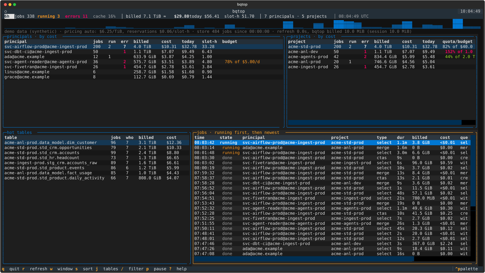

# bqtop

htop for BigQuery. A terminal dashboard that shows who is running what on your BigQuery projects
right now, what it costs, which tables are hot, and where today's spend stands against quotas and
budgets.



It reads the metadata BigQuery already keeps, backfills once, then refreshes incrementally like `htop`.
No agents, no sinks to build, no dashboards to click through.

```bash
brew install dadadima/tap/bqtop                            # macOS / Linux binary, no Python needed
# or: uv tool install git+https://github.com/dadadima/bqtop   (pipx works too)
# or: grab a binary from https://github.com/dadadima/bqtop/releases

bqtop --demo                                               # look around on synthetic data, no GCP needed
bqtop --init                                               # interactive setup: detects your project, writes the config
bqtop                                                      # the TUI
```

`bqtop --init` asks five questions (source, project, scope, pricing, timezone), writes
`~/.config/bqtop/config.toml` and runs `bqtop --check`, which tells you who you are, what the source
scan costs, and the exact role to grant if something is missing.

## What you see

| panel          | what                                                                                                      |
| -------------- | --------------------------------------------------------------------------------------------------------- |
| summary        | jobs, running, errors, cache-hit ratio, bytes billed and cost in the window, cost today, slot-hours       |
| timeline       | cost per time bucket across the window, so a spike is visible before the bill is                          |
| principals     | who: jobs, running, errors, billed, cost, cost today, slot-hours, daily budget %                          |
| projects       | where: same, plus today's `QueryUsagePerDay` quota % or budget %                                          |
| hot tables     | which tables the money goes to (a job touching three tables counts against all three: an upper bound)     |
| dbt models     | `d` swaps in cost per dbt model, parsed from dbt's query comment (`node_id`)                             |
| jobs           | live stream, running first, then newest: state, principal, project, type, duration, billed, cost, query   |

Press `enter` on a principal, project or table to drill down (everything filters to it), on a job to see
its details and full query text.

## Keys

| key     | action                                                              |
| ------- | ------------------------------------------------------------------- |
| `q`     | quit                                                                |
| `r`     | refresh now                                                         |
| `w`     | wider window: 1h → 6h → 24h → 72h → 168h                            |
| `s`     | cycle sort: cost, bytes, jobs, errors, slots                        |
| `j`     | hide/show the tables panel (widens the job stream)                  |
| `d`     | tables panel: hot tables ↔ dbt models                               |
| `/`     | filter on principal, project, table, query text or error message   |
| `esc`   | clear the filter / close a dialog                                   |
| `p`     | pause auto-refresh                                                  |
| `enter` | drill down on a row; job details on a job                           |
| `?`     | help                                                                |

Sorting, filtering and drill-down never touch BigQuery: they re-aggregate the local store. Widening the
window backfills the missing range once.

## Sources

Pick one with `[source].kind`. Both are standard GCP surfaces.

| kind                 | reads                                                            | running jobs | permissions                                                                                              |
| -------------------- | ---------------------------------------------------------------- | ------------ | -------------------------------------------------------------------------------------------------------- |
| `information_schema` | `INFORMATION_SCHEMA.JOBS_BY_{PROJECT,FOLDER,ORGANIZATION,USER}`  | yes          | `bigquery.jobs.listAll` at that level, e.g. `roles/bigquery.resourceViewer`; nothing extra for `user`    |
| `audit_log`          | a routed `cloudaudit_googleapis_com_data_access` table            | no           | `dataViewer` on the sink table, `jobUser` on the billing project                                         |

`information_schema` is the default: real time, includes `RUNNING` jobs, nothing to set up.
`scope = "folder"` gives one view over every project under the folder that directly contains
`billing_project`, sub-folders included. To watch a whole tree, run bqtop from a project that sits right
under the top folder; `bqtop --check` prints how many projects the source actually sees.
`audit_log` is for setups that already route BigQuery audit logs to a table (a folder- or org-level
sink), which also works when you cannot get `jobs.listAll` everywhere.

Authentication is whatever `google-cloud-bigquery` finds: Application Default Credentials
(`gcloud auth application-default login`), a service-account key via `GOOGLE_APPLICATION_CREDENTIALS`,
or the metadata server. Set `[source].credentials_file` to a service-account key to pin the identity
instead, useful when your user login expires daily. `bqtop --check` tells you who you are and what is missing.

## Configuration

`~/.config/bqtop/config.toml`, or `./bqtop.toml` in the current directory. Full example with comments in
[`examples/config.example.toml`](examples/config.example.toml).

```toml
[source]
kind = "information_schema"
billing_project = "my-admin-project"     # runs and pays for bqtop's own queries
regions = ["us"]
scope = "folder"                         # project | folder | organization | user

[pricing]
mode = "auto"                            # auto | on_demand | slots
on_demand_usd_per_tib = 6.25
slot_usd_per_hour = 0.06                 # Editions pay-as-you-go: standard 0.04, enterprise 0.06, plus 0.10

[pricing.projects]
"my-dbt-project" = { mode = "slots", slot_usd_per_hour = 0.04 }

[quotas]                                 # daily QueryUsagePerDay caps, shown as % used today
"my-agents-project" = "5 TiB"

[budgets]                                # daily spend budgets, USD, by principal or project
"svc-airflow@my-ingest.iam.gserviceaccount.com" = 50
"my-agents-project" = "$10"

[ui]
refresh_seconds = 60
window_hours = 24
max_window_hours = 168
timezone = "Europe/Brussels"
top_n = 15
stream_rows = 40
```

### Pricing

BigQuery bills analysis either on demand (bytes) or through slots (Editions). `mode = "auto"` prices
each job by how it actually ran: in a reservation, slot-hours × `slot_usd_per_hour`; otherwise bytes
billed × `on_demand_usd_per_tib`. Override per project when a project is on a different edition. The
result is an estimate, not the invoice: storage, streaming inserts, Storage Read API and egress are not
in job metadata.

### Quotas and budgets

`[quotas]` holds `QueryUsagePerDay` caps in bytes per project. `[budgets]` holds dollars per day for a
principal or a project. Both compare against **today**: bytes billed or cost since local midnight in
`[ui].timezone`, independent of the window you are looking at. Cells turn yellow at 60 % and red at 90 %.

## Scripting

```bash
bqtop --once                       # Rich tables, one snapshot
bqtop --once -w 6 --sort errors    # 6 hours, worst offenders first
bqtop --once -f svc-airflow        # only jobs matching a text
bqtop --once --json | jq '.by_principal[0]'
bqtop --watch 30                   # plain-text refresh every 30 s, for tmux panes
bqtop --check                      # exits non-zero with hints if something is missing
```

## What it costs to run

bqtop bills its own queries to `billing_project`. On `information_schema` each refresh is one query with
a 10 MiB minimum, so a 60 s refresh is under a dollar a month. On `audit_log` the sink table is
day-partitioned, so each incremental refresh rescans the current day's partition; the summary line shows
what the last refresh billed and the session total. `bqtop --check` prints what a 24 h backfill scans.

## Not covered

Storage Read API sessions, network egress, storage and streaming costs do not appear in job metadata.
If you stream tables out with Spark, DuckDB or Arrow clients, that spend is invisible here; Cloud Billing
export is the place for it. A billing-export source is the natural next step.

## Releases

Every `v*` tag builds single-file binaries (PyInstaller) for macOS arm64 / x86_64 and Linux arm64 /
x86_64, attaches them to a GitHub release with their sha256 and a generated Homebrew formula, and
updates [`dadadima/homebrew-tap`](https://github.com/dadadima/homebrew-tap). `scripts/build_binary.sh`
does the same locally.

## Development

```bash
uv sync --extra dev
uv run pytest
uv run ruff check src tests && uv run ruff format src tests
uv run python scripts/screenshot.py     # regenerate docs/screenshot.svg from the demo source
```

MIT.
